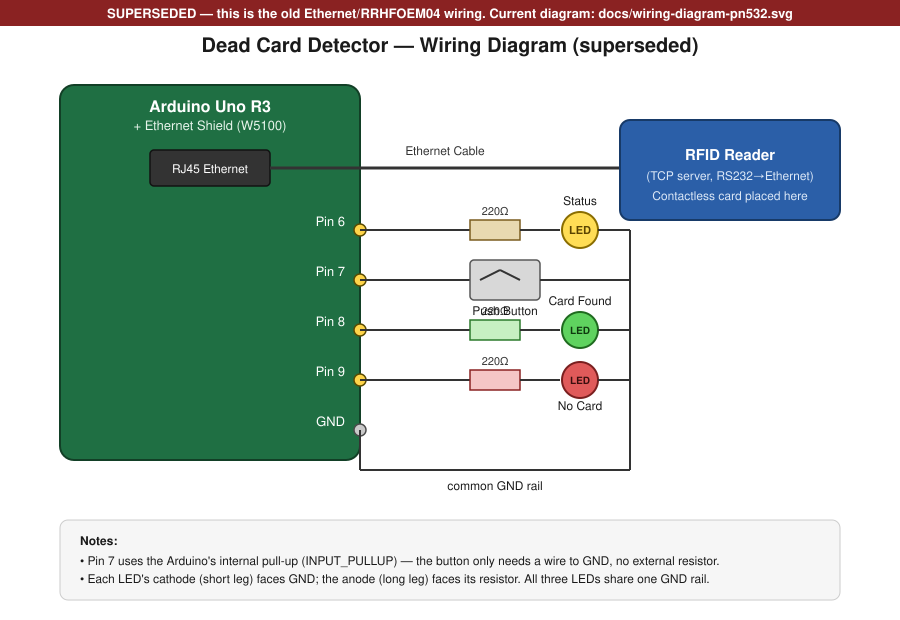
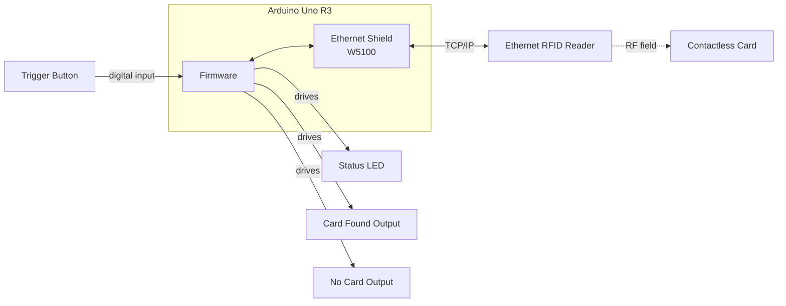
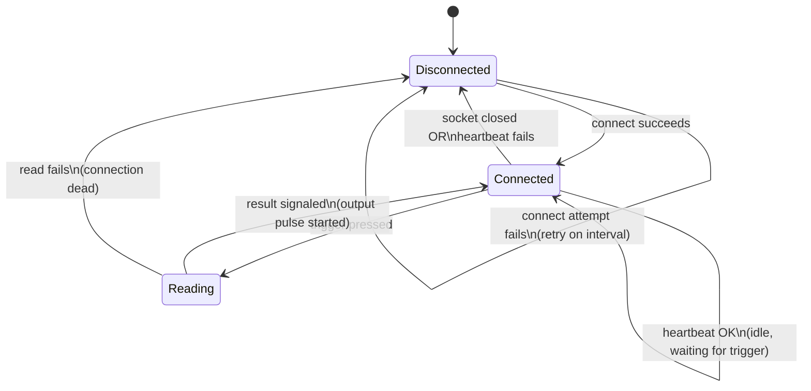

# Dead Card Detector

A standalone Arduino Uno firmware that checks whether a contactless smart
card is present and responsive on an Ethernet-based RFID reader — no PC
required during normal operation.

Built for industrial/automated environments where a simple pass/fail
signal ("card responded" vs "no card") needs to be fed into other
equipment (a PLC, relay, indicator lights, etc.) at the press of a
button.

## Features

- **TCP client with auto-reconnect** — maintains a persistent connection
  to the reader and automatically recovers from dropped connections or
  reader power cycles, without ever requiring a manual reset.
- **Active heartbeat** — periodically verifies the reader is actually
  responsive, not just that the socket looks open, so a dead link is
  caught within seconds.
- **Debounced trigger input** — a single push-button press reliably
  fires exactly one read cycle.
- **Two-output result signaling** — pulses a dedicated output pin for a
  configurable duration depending on whether a card responded, ready to
  drive an LED, relay, or PLC input.
- **Non-blocking design** — all timing (reconnects, heartbeats, output
  pulses) is handled with `millis()`-based scheduling, so the firmware
  never freezes or requires a watchdog reset during normal operation.

## Hardware

- Arduino Uno R3
- Arduino Ethernet Shield (W5100-based)
- An Ethernet-connected RFID reader acting as a TCP server

### Wiring overview

| Signal | Pin | Notes |
|---|---|---|
| Connection status LED | 6 | Pin → resistor → LED → GND |
| Trigger button | 7 | Button to GND, uses internal pull-up (no external resistor) |
| "Card found" output | 8 | Pin → resistor → LED (or relay/PLC input) |
| "No card" output | 9 | Pin → resistor → LED (or relay/PLC input) |

Pin numbers and timing values are defined as named constants at the top
of the sketch and can be changed without touching the rest of the logic.

### Wiring diagram

- Pin 7 uses the Arduino's internal pull-up (`INPUT_PULLUP`), so the
  button only needs to connect Pin 7 to GND — no external resistor.
- Each LED's cathode (short leg) returns to GND; the anode (long leg)
  goes through its 220Ω resistor back to the driving pin.

## Configuration

Network settings (Arduino IP, reader IP, reader port) and all timing
values (reconnect interval, heartbeat interval, debounce time, output
pulse duration) are grouped at the top of the `.ino` file as named
constants. Update these to match your network and hardware before
uploading.

## Architecture

### System overview

The Arduino is the only intelligence in the system. It acts as a TCP
client to the reader (which acts as a TCP server), reads one physical
input (the trigger button), and drives three physical outputs (status
LED plus the two result LEDs). No PC is involved once deployed.

### Firmware state machine

- **Disconnected**: no active TCP session. Retries on a fixed interval,
  indefinitely, with no manual reset ever required.
- **Connected**: session is up. A background heartbeat periodically
  confirms the reader is still responsive, independent of the trigger.
- **Reading**: entered only on a debounced trigger press. Queries the
  reader for the card's UID and signals the result on one of the two
  output pins before returning to **Connected**.

### Design principles

- **Non-blocking timing** — all delays (reconnect backoff, heartbeat
  interval, output pulse duration) are implemented with `millis()`
  comparisons rather than `delay()`, so the firmware never freezes.
- **Single source of truth for connection state** — the state machine
  above is the only place connection status is decided; both the
  heartbeat and the trigger-driven read report into it rather than
  managing their own reconnect logic.
- **Fail-safe outputs** — an output pin only pulses when the firmware
  has a definite answer. If the network itself fails mid-read, neither
  output fires, since "card not found" and "couldn't ask" are treated as
  different outcomes.

## How it works

1. On boot, the Arduino connects to the reader over TCP and retries
   automatically until successful.
2. While connected, a background heartbeat periodically confirms the
   reader is still responsive. If it stops responding, the firmware
   drops the connection and resumes reconnect attempts — no manual
   intervention needed.
3. The operator places a card on the reader, then presses the trigger
   button.
4. The firmware queries the reader for the card's UID.
5. Depending on the result, one of two output pins pulses HIGH for a
   fixed duration: one for "card detected", one for "no card detected."

## Status

Actively developed in stages (basic connectivity → reliable
reconnection → card read → output signaling). See commit history for
progress.

## License

Add a license of your choice before publishing.
