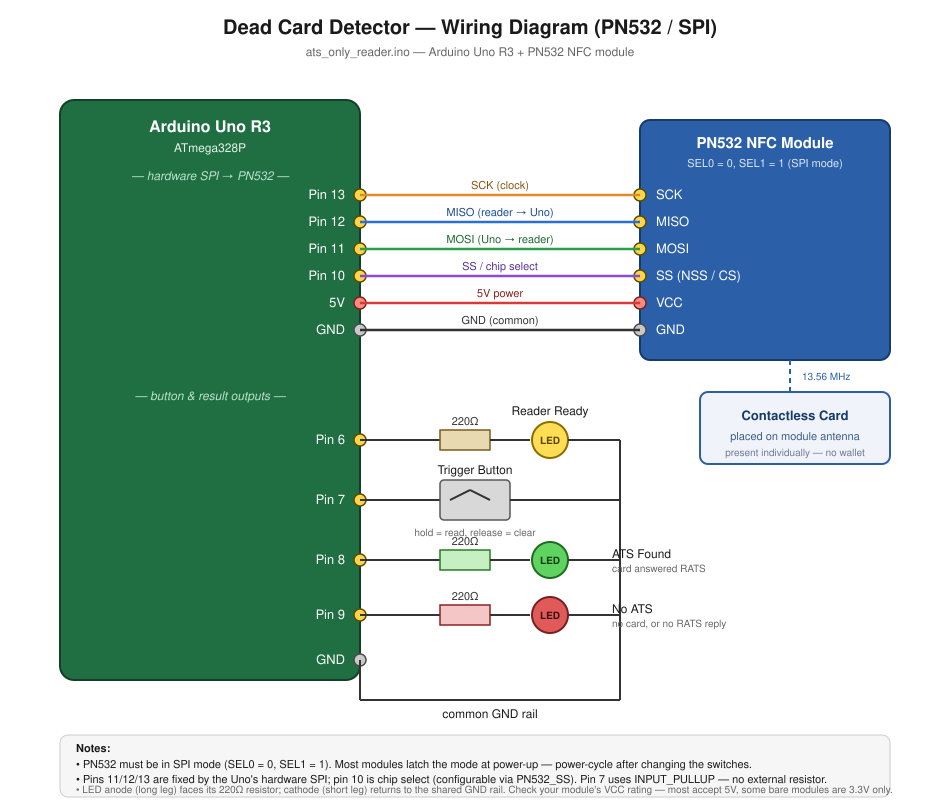
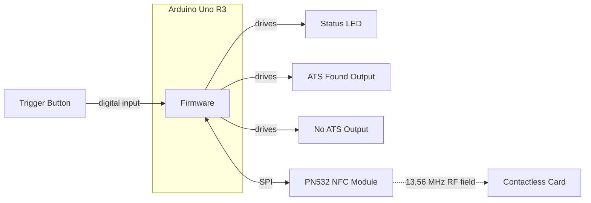
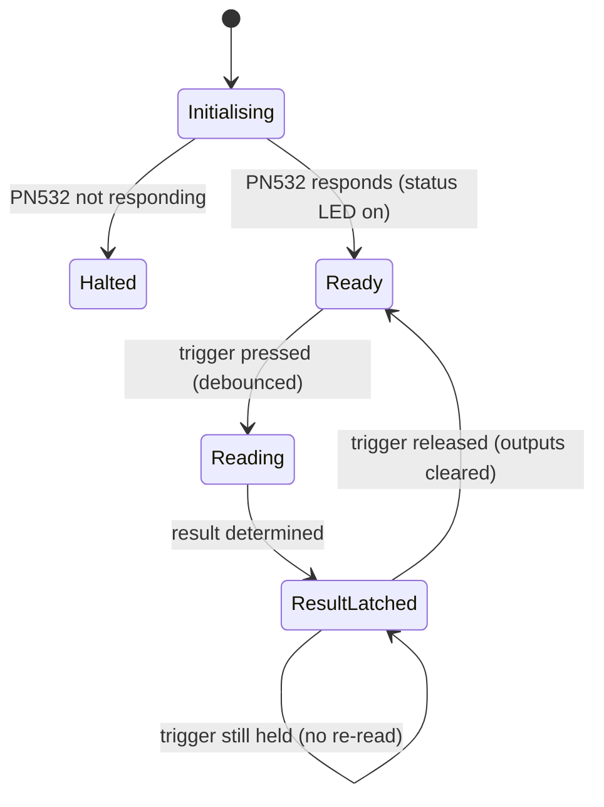

# Dead Card Detector

A standalone Arduino Uno firmware that checks whether a contactless smart
card is present and responsive on a PN532 NFC reader — no PC required
during normal operation.

Built for industrial/automated environments where a simple pass/fail
signal needs to be fed into other equipment (a PLC, relay, indicator
lights, etc.) at the press of a button.

Detection is based on **ATS** (Answer To Select): the firmware activates
the card and sends a **RATS** (Request for Answer To Select) command. A
card that answers has completed the ISO/IEC 14443-4 handshake — a deeper
confirmation of life than simply returning a UID.

## Features

- **ATS-based liveness check** — confirms the card completed an
  ISO/IEC 14443-4 protocol handshake, not just that an RF field
  detected something.
- **Debounced trigger input** — a single push-button press reliably
  fires exactly one read cycle, with mechanical switch bounce filtered
  out in software.
- **Hold-to-latch result signaling** — the result is latched on a
  dedicated output pin for as long as the button is held, ready to drive
  an LED, relay, or PLC input. Releasing the button clears it.
- **Fast, bounded failure** — the PN532's internal retry count is capped
  so pressing the trigger with no card present returns promptly instead
  of blocking.
- **Self-verifying startup** — the firmware queries the reader's
  firmware version on boot and halts with a clear error rather than
  running blind against a reader that isn't responding.
- **No `delay()` calls** — trigger debouncing is `millis()`-based, so
  timing logic never busy-waits. (A read itself blocks briefly while the
  PN532 polls for a card; typical time-to-result is logged to serial.)

## Tech stack

| Layer | Technology |
| --- | --- |
| Language | C++ (Arduino dialect) |
| Microcontroller | Arduino Uno R3 (ATmega328P, 16 MHz, 2 KB SRAM) |
| RFID/NFC front-end | NXP PN532 (13.56 MHz) |
| Host ↔ reader bus | Hardware SPI |
| Reader library | [Adafruit_PN532](https://github.com/adafruit/Adafruit-PN532) (pulls in Adafruit_BusIO) |
| Built-in libraries | `SPI.h` |
| Card standards | ISO/IEC 14443-3 (activation, anti-collision), ISO/IEC 14443-4 (RATS/ATS, T=CL) |
| Debug interface | USB serial @ 9600 baud |
| Build/upload | Arduino IDE or `arduino-cli` |
| Docs | Markdown + Mermaid diagrams |
| Version control | Git |

## Hardware

- Arduino Uno R3
- PN532 NFC/RFID module, set to **SPI** mode via its SEL0/SEL1 switches
- Push button (no external resistor needed)
- 3 × LED + 220Ω resistor, or relay/PLC inputs

### Wiring overview

| Signal | Pin | Notes |
| --- | --- | --- |
| PN532 SCK | 13 | Fixed by hardware SPI |
| PN532 MISO | 12 | Fixed by hardware SPI |
| PN532 MOSI | 11 | Fixed by hardware SPI |
| PN532 SS | 10 | Configurable (`PN532_SS` in sketch) |
| Status LED | 6 | Pin → resistor → LED → GND |
| Trigger button | 7 | Button to GND, uses internal pull-up (no external resistor) |
| "ATS found" output | 8 | Pin → resistor → LED (or relay/PLC input) |
| "No ATS" output | 9 | Pin → resistor → LED (or relay/PLC input) |

Pin numbers and timing values are defined as named constants at the top
of the sketch and can be changed without touching the rest of the logic.

### Wiring diagram



- The PN532 module must be set to **SPI mode** (`SEL0 = 0`, `SEL1 = 1`).
  Most modules latch the interface mode at power-up, so power-cycle the
  board after changing the switches.
- Pins 11, 12, and 13 are fixed by the Uno's hardware SPI and cannot be
  reassigned. Pin 10 is the chip select and is configurable via
  `PN532_SS` in the sketch.
- Pin 7 uses the Arduino's internal pull-up (`INPUT_PULLUP`), so the
  button only needs to connect Pin 7 to GND — no external resistor.
- Each LED's cathode (short leg) returns to GND; the anode (long leg)
  goes through its 220Ω resistor back to the driving pin.

Full wiring detail, including the SEL0/SEL1 mode table, voltage
warnings, and a wiring troubleshooting checklist, is in
[`ats_only_reader/wiring-connections.md`](ats_only_reader/wiring-connections.md).

## Configuration

Pin assignments, the debounce interval, the PN532 retry cap, and the
RATS command bytes are all grouped at the top of
`ats_only_reader/ats_only_reader.ino` as named constants. Adjust them
there to match your hardware before uploading.

There is no network configuration — the reader is wired directly to the
Arduino over SPI.

## Getting started

1. Wire the hardware per
   [`ats_only_reader/wiring-connections.md`](ats_only_reader/wiring-connections.md).
2. Set the PN532 module's SEL0/SEL1 switches to SPI (`0`, `1`), then
   power-cycle the board.
3. Install the **Adafruit PN532** library via the Arduino IDE Library
   Manager (Sketch → Include Library → Manage Libraries).
4. Open `ats_only_reader/ats_only_reader.ino`, select Arduino Uno and
   the correct port, and upload.
5. Open the Serial Monitor at 9600 baud to watch results.

## How it works

1. On boot, the firmware initialises the PN532 over SPI and queries its
   firmware version. If the reader doesn't respond, it prints an error
   and halts rather than running blind.
2. Once initialised, the status LED lights to indicate the reader is
   ready.
3. The operator places a card on the reader, then presses and holds the
   trigger button.
4. The firmware re-initialises the reader, activates the card
   (`InListPassiveTarget`), and sends **RATS**.
5. Depending on the result, one of two output pins latches HIGH and
   stays there while the button is held:
   - **Pin 8** — the card answered RATS. Its ATS bytes are logged to
     serial.
   - **Pin 9** — no card was found, or the card did not answer RATS.
6. Releasing the button clears both outputs, ready for the next read.

Exactly one of the two result pins is asserted per read — never both,
never neither.

## Architecture

### System overview



The Arduino is the only intelligence in the system. It drives the PN532
directly over SPI, reads one physical input (the trigger button), and
drives three physical outputs (status LED plus the two result lines). No
PC is involved once deployed.

### Firmware state machine



- **Initialising**: SPI brought up, PN532 wakeup and `SAMConfig` run,
  firmware version verified.
- **Halted**: terminal state, entered only if the reader never
  responded. Requires a power cycle or reset.
- **Ready**: idle, waiting for a trigger press.
- **Reading**: reader re-initialised, card activated, RATS sent.
- **ResultLatched**: one output pin held HIGH for the duration of the
  button hold. Exactly one read happens per press, regardless of how
  long the button is held.

### Design principles

- **Non-blocking trigger handling** — debouncing is implemented with
  `millis()` comparisons rather than `delay()`, so the main loop stays
  responsive.
- **One read per press** — a latch flag ensures a held button doesn't
  re-run the read on every loop iteration.
- **Deterministic outputs** — every read asserts exactly one of the two
  result pins, so downstream equipment never sees an ambiguous state.
- **Fail loudly on missing hardware** — a reader that doesn't respond
  halts startup with a clear serial message instead of silently
  reporting every card as dead.

## Known limitations

- **Not every live card returns an ATS.** ATS requires ISO/IEC 14443-4
  support. MIFARE Classic, Ultralight, and NTAG chips — common in
  transit/metro cards and access badges — are ISO/IEC 14443-3 only and
  will read as "No ATS" even though they are perfectly functional.
  EMV bank cards, MIFARE DESFire, and MIFARE Plus SL3 do support it.
  See the full card-type table in
  [`docs/ats-based-detection-proposal.md`](docs/ats-based-detection-proposal.md).
  If you need to detect *any* contactless card regardless of type,
  UID-based detection is the appropriate signal, not ATS.
- **RATS is only valid once per card activation.** Per ISO/IEC 14443-4,
  a card that has already answered RATS will not answer again until it
  is deactivated and re-activated. The Adafruit PN532 library exposes no
  public deactivate (`InRelease`/`InDeselect`) call, so the sketch
  re-runs `begin()` + `SAMConfig()` before each read as a workaround.
  This has not been verified against hardware across repeated reads —
  if a second consecutive read on an unmoved card fails, lifting and
  re-presenting the card is the reliable fallback.
- **Card positioning matters.** During development, one specific bank
  card failed to activate at all while others succeeded, traced to
  physical RF factors (wallet interference from adjacent cards, antenna
  coupling, possible antenna damage) rather than firmware. Cards should
  be presented individually, removed from wallets and RFID-blocking
  sleeves.

## Project layout

```
ats_only_reader/
  ats_only_reader.ino            # The firmware
  ats_only_reader_explained.md   # Line-by-line walkthrough of the sketch
  wiring-connections.md          # Full wiring reference and troubleshooting
docs/
  wiring-diagram-pn532.svg        # Current wiring diagram (PN532 / SPI)
  ats-based-detection-proposal.md # Why ATS; card-type support table
  troubleshooting-uid-read.md     # Historical: UID read investigation
  capture-protocol-bytes.md       # Historical: protocol capture method
  code-explained.md               # Historical: describes the removed sketch
  wiring-diagram.svg              # Historical: superseded Ethernet wiring
```

Files marked *historical* document the project's earlier Ethernet-based
RRHFOEM04 reader implementation, which was replaced by the PN532. They
are kept for the investigation trail — notably the finding that the
RRHFOEM04's command set stops at ISO/IEC 14443-3 and cannot retrieve ATS
at all, which is what motivated the move to the PN532. They do **not**
describe the current firmware or wiring.

## Status

Actively developed. The UID-reading module was removed in favour of a
focused ATS-based reader; see commit history for the progression from
the original Ethernet/TCP reader implementation to the current PN532 SPI
firmware.


