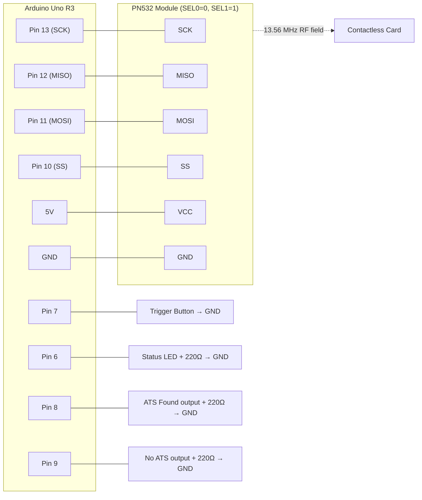

# `ats_only_reader` — Wire Connections

Wiring reference for `ats_only_reader.ino`. All pin numbers below match the
constants declared at the top of that sketch — if you change them there,
change them here too.

Target hardware: **Arduino Uno R3** + **PN532 NFC module** over **hardware SPI**.

---

## 1. PN532 module → Arduino Uno

The Uno's hardware SPI pins are fixed by the microcontroller and cannot be
reassigned. Only the chip-select (SS) line is chosen in software.

| PN532 pin | Uno pin | Fixed or configurable | Notes |
| --- | --- | --- | --- |
| SCK | 13 | Fixed (hardware SPI) | Serial clock |
| MISO | 12 | Fixed (hardware SPI) | PN532 → Arduino data |
| MOSI | 11 | Fixed (hardware SPI) | Arduino → PN532 data |
| SS / SSEL / NSS | 10 | Configurable (`PN532_SS` in sketch) | Chip select, active LOW |
| VCC | 5V | — | See voltage warning below |
| GND | GND | — | Common ground, required |

Because pins 11, 12, and 13 are consumed by SPI, **do not** wire anything
else to them.

### Voltage warning

Most hobby PN532 breakout boards (Adafruit breakout, Elechouse V3/V4,
and the common red clones) include an onboard regulator and level
shifting, so they accept **5V** on VCC. Some bare modules are **3.3V
only** and can be damaged by 5V.

Check your specific board's silkscreen or datasheet before connecting
power. If the board is marked 3.3V only, feed it from the Uno's 3.3V pin
instead.

### Reset / power-down pin

Some PN532 boards expose a reset pin labelled `RSTPDN`, `RSTO`, or
`RST`. On certain boards, leaving this pin floating holds the chip in
power-down, and it will never respond over SPI no matter how correct the
rest of the wiring is.

If your board has this pin, tie it to the board's logic-level supply
(the same rail you used for VCC) so the chip is not held in reset.

---

## 2. Interface mode switches (SEL0 / SEL1)

The PN532 supports three host interfaces, selected by two switches or
solder jumpers on the module itself. This sketch requires **SPI**.

| Interface | SEL0 | SEL1 |
| --- | --- | --- |
| UART / HSU | 0 | 0 |
| **SPI (required here)** | **0** | **1** |
| I2C | 1 | 0 |

Two things that commonly cause "Could not find PN532 board":

- The switches are set to UART or I2C rather than SPI.
- The switches were changed while the board stayed powered. Most PN532
  boards latch the interface mode **only at power-up**, so fully
  unplug the Arduino, wait a couple of seconds, and reconnect after
  changing them.

---

## 3. Trigger button → Arduino Uno

| Signal | Uno pin | Wiring |
| --- | --- | --- |
| Trigger button | 7 | One leg to pin 7, other leg to GND |

Pin 7 is configured as `INPUT_PULLUP` in the sketch, so the Arduino
supplies its own pull-up resistor internally. **No external resistor is
needed.** The pin idles HIGH and reads LOW while the button is held.

Button behaviour in this sketch (hold-to-read, not press-to-pulse):

- **Press and hold** → one read is performed, and the result is latched
  on the output pins for as long as you keep holding.
- **Release** → both output pins return LOW.

Holding the button longer does not repeat the read; exactly one read
happens per press.

---

## 4. Status and result outputs → Arduino Uno

| Signal | Uno pin | Meaning |
| --- | --- | --- |
| Status LED | 6 | HIGH once the PN532 initialised successfully ("ready") |
| ATS found | 8 | Latched HIGH while trigger held, if the card answered RATS |
| No ATS | 9 | Latched HIGH while trigger held, if no card was found **or** the card did not answer RATS |

Each of pins 6, 8, and 9 can drive an LED, or feed a relay board / PLC
input if you are integrating this into other equipment.

For a plain LED on any of these pins:

```
Pin ──[ 220Ω resistor ]──▶│ LED ──── GND
                    (anode)   (cathode)
```

The LED's long leg (anode) goes toward the resistor and Arduino pin; the
short leg (cathode) returns to GND.

Exactly one of pin 8 or pin 9 is asserted per read — never both, and
never neither.

---

## 5. Full connection summary



---

## 6. Pin usage at a glance

| Uno pin | Used for | Free to reuse? |
| --- | --- | --- |
| 6 | Status LED | No |
| 7 | Trigger button | No |
| 8 | ATS found output | No |
| 9 | No ATS output | No |
| 10 | PN532 SS | No |
| 11 | PN532 MOSI (hardware SPI) | No |
| 12 | PN532 MISO (hardware SPI) | No |
| 13 | PN532 SCK (hardware SPI) | No |
| 0, 1 | Serial (USB debug @ 9600 baud) | Avoid |
| 2–5, A0–A5 | Unused by this sketch | Yes |

---

## 7. Verifying the wiring

1. Open the Serial Monitor at **9600 baud** and reset the board.
2. A correct setup prints:

   ```
   Initializing PN532...
   Found PN532
   Firmware version: 1.6
   Reader ready. This sketch checks ATS only (no UID output).
   ```

   The status LED on pin 6 also turns on at this point.

3. If it instead prints `Could not find PN532 board. Check wiring.` the
   sketch halts deliberately, since nothing can work without the
   reader. Work through these in order:
   - SEL0/SEL1 set to SPI (`0`, `1`), then **power-cycle** the board.
   - MISO and MOSI not swapped (this is the single most common SPI
     wiring mistake).
   - `RSTPDN`/`RSTO` pin tied high, if your board has one.
   - GND connected between both boards.
   - VCC on the correct rail for your board's voltage rating.
   - As an isolation test, run the library's own unmodified example
     (**File → Examples → Adafruit PN532 → readMifare**). Note that
     example defaults to *software* SPI on pins 2/3/4/5, so wire to
     those pins for that test. If the example also fails, the problem
     is hardware/wiring rather than this sketch.

---

## Related documents

- [`ats_only_reader_explained.md`](ats_only_reader_explained.md) — line-by-line explanation of the sketch.
- [`../docs/ats-based-detection-proposal.md`](../docs/ats-based-detection-proposal.md) — why ATS is used as the signal, and the table of which card types return ATS.
